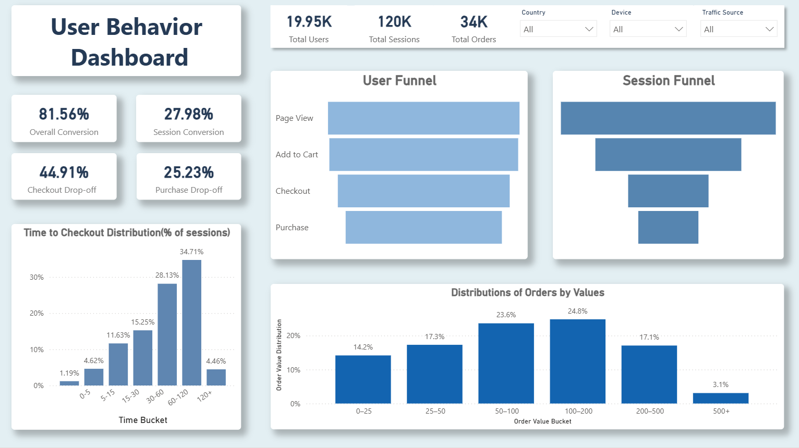
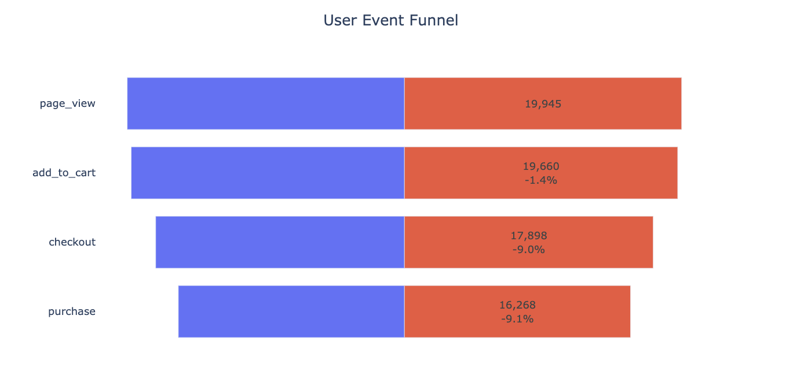
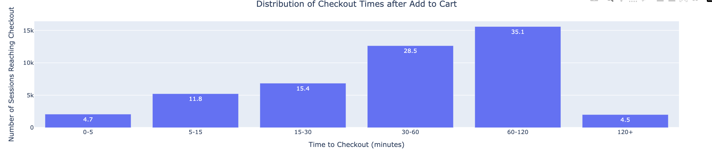
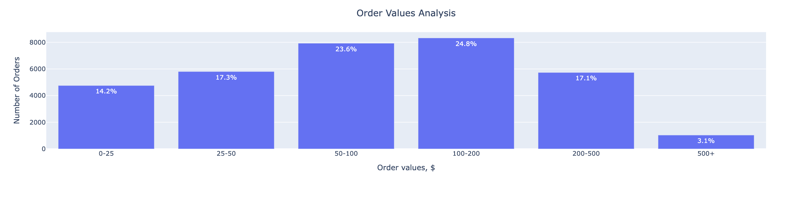

#  User Behavior Funnel Analysis (E-commerce)

## Dashboard Preview

Key metrics and funnel analysis visualized in Power BI:

[Open Interective Dashboard]([https://app.powerbi.com/view?r=eyJrIjoiOTVhYjNiNmEtM2ZhNS00ZjUwLThiYTctM2Q0NTRiMWEyMDA4IiwidCI6ImRmODY3OWNkLWE4MGUtNDVkOC05OWFjLWM4M2VkN2ZmOTVhMCJ9](https://app.powerbi.com/view?r=eyJrIjoiOTVhYjNiNmEtM2ZhNS00ZjUwLThiYTctM2Q0NTRiMWEyMDA4IiwidCI6ImRmODY3OWNkLWE4MGUtNDVkOC05OWFjLWM4M2VkN2ZmOTVhMCJ9))

---

##  Project Overview

This project analyzes user behavior across an e-commerce funnel to identify key drop-off points and understand what factors influence conversion from browsing to purchase.

The main focus is on two critical transitions:
- Add to Cart → Checkout
- Checkout → Purchase

---

##  Objectives

- Identify where users drop off in the funnel
- Analyze whether user characteristics and behavior impact conversion
- Generate insights and product recommendations to improve conversion rates

---

##  Dataset

Synthetic E-commerce dataset including:
- `customers` — user profiles
- `sessions` — session metadata (device, source, country)
- `events` — user actions (page_view, add_to_cart, checkout, purchase)
- `orders` — completed purchases

---

##  Analysis Approach

### Funnel Analysis
- Conversion rates across funnel stages
- Identification of main drop-off points

### Session-level Analysis
Tested impact of:
- Device
- Traffic source
- Country
- Cart size
- Time to checkout

### Order-level Analysis
Explored:
- Payment method distribution
- Discount usage
- Order value distribution

---
## Key Visualizations

### Funnel Overview

### Time to Checkout

### Order Value Distribution

---
##  Key Findings

- Major drop-off occurs **before checkout** (~45% of users do not proceed)
- Checkout → Purchase conversion is relatively strong (~74%)
- No significant impact found from:
  - Device
  - Traffic source
  - Country
  - Time to checkout
- Order-level factors (payment, discount, value) reflect preferences, but do not explain conversion drop-offs

---

##  Limitations

- No detailed event tracking within checkout flow
- Payment and revenue data available only for completed purchases
- Cannot directly analyze failed checkout attempts

---

##  Recommendations

- Simplify checkout flow
- Reduce friction (mandatory fields, steps)
- Show full pricing earlier (shipping, taxes)
- Improve UX, especially on mobile
- Track detailed checkout steps for deeper analysis

---

## Tools & Technologies

- Python (Pandas, Plotly)
- SQL (DBeaver)
- Jupyter Notebook
- Power BI  

---

## Project Presentation

Video walkthrough: [Watch video](https://www.loom.com/share/afb4b7e7b35441048857f1a80bfa915b)
